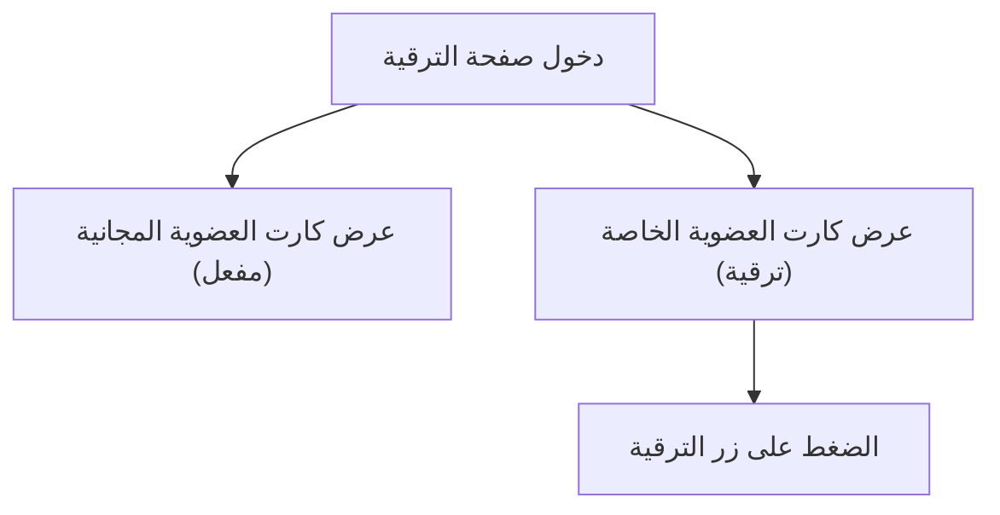

# مستند متطلبات المنتج (PRD) - واجهة كروت العضوية والترقية

## 1. نظرة عامة على المنتج
صفحة ويب تعرض بطاقات (كروت) العضوية والترقية لمنصة تعتمد على إنجاز المهام وسحب الأرباح. 
الهدف هو توفير واجهة عصرية وجذابة لتشجيع المستخدمين على الترقية من العضوية المجانية إلى العضوية الخاصة، مع توضيح الفروق بينهما بشكل مرئي واضح.

## 2. الميزات الأساسية

### 2.1 وحدة الميزات
1. **كارت العضوية المجانية**: يعرض تفاصيل العضوية المجانية ويكون بحالة "مفعل".
2. **كارت العضوية الخاصة (الترقية)**: يعرض تفاصيل ومزايا العضوية المدفوعة لتشجيع المستخدمين.

### 2.2 تفاصيل الصفحة
| اسم الصفحة | اسم الوحدة | وصف الميزة |
|------------|------------|------------|
| صفحة الترقية | كارت العضوية المجانية | يحتوي على شارة "مفعل"، ميزة: مهمة واحدة في اليوم، أسعار الأرباح، سحب بطيء خلال 48 ساعة. |
| صفحة الترقية | كارت العضوية الخاصة | ميزة: من 3 إلى 10 مهام يومياً، سحب سريع خلال 4 ساعات، أسعار أعلى للمهام ودعوات الأصدقاء، زر للترقية. |

## 3. العمليات الأساسية
يصل المستخدم إلى صفحة الترقية، ويرى العضوية المجانية المفعلة حالياً، ثم يقرأ ميزات العضوية الخاصة لاتخاذ قرار الترقية.

## 4. تصميم واجهة المستخدم
### 4.1 نمط التصميم
- **الألوان الأساسية**: البنفسجي (كلون رئيسي يعبر عن الفخامة والتميز) والأبيض (للخلفيات والنصوص لضمان الوضوح).
- **الألوان الثانوية**: الأخضر (للمسات، مثل شارة "مفعل" وزر الترقية ومؤشرات النجاح).
- **نمط الأزرار**: حواف دائرية (Rounded) مع تأثيرات عند التمرير (Hover effects) وتدرجات لونية عصرية.
- **الخطوط**: خطوط عربية عصرية وواضحة (مثل Cairo أو Tajawal).
- **نمط التخطيط**: نظام البطاقات (Card-based layout) مع تأثيرات الظلال الخفيفة لإبراز الكروت (Glassmorphism أو ظلال ناعمة).

### 4.2 نظرة عامة على تصميم الصفحة
| اسم الصفحة | اسم الوحدة | عناصر واجهة المستخدم |
|------------|------------|----------------------|
| صفحة الترقية | حاوية الكروت | خلفية بيضاء أو رمادية فاتحة جداً مع تدرجات بنفسجية خفيفة، تخطيط مرن (Flexbox/Grid). |
| صفحة الترقية | الكروت | خلفية بيضاء للكارت، نصوص بنفسجية وداكنة، أيقونات خضراء وبنفسجية، زر ترقية بارز. |

### 4.3 التجاوب (Responsiveness)
- تصميم متجاوب يبدأ بالشاشات المكتبية (Desktop-first) ويتكيف بسلاسة مع الأجهزة المحمولة (Mobile-adaptive) بحيث تظهر الكروت بشكل عمودي على الشاشات الصغيرة.
