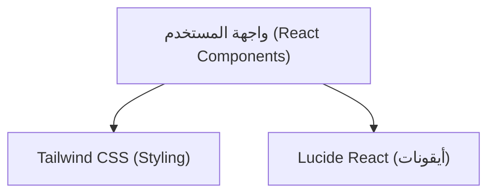

# هيكلية التقنية (Technical Architecture) - واجهة كروت العضوية والترقية

## 1. تصميم الهيكلية
يقتصر المشروع على واجهة أمامية (Frontend) فقط لعرض كروت العضوية بشكل عصري.

## 2. وصف التكنولوجيا
- **الواجهة الأمامية**: React@18 + Vite
- **التنسيق والتصميم**: Tailwind CSS v3
- **الأيقونات**: lucide-react
- **أداة التهيئة**: vite-init (أو إنشاء المشروع عبر Vite مباشرة)

## 3. تعريفات المسارات (Routes)
| المسار | الغرض |
|--------|---------|
| `/` | الصفحة الرئيسية التي تعرض كروت العضوية والترقية |

## 4. تعريفات واجهة برمجة التطبيقات (API)
(لا يوجد واجهة خلفية أو API في هذا المشروع، الواجهة ثابتة مبدئياً)

## 5. هيكلية الخادم (Server Architecture)
(لا يوجد خادم، تطبيق واجهة أمامية فقط)

## 6. نموذج البيانات (Data Model)
(بيانات العضويات ثابتة ومدمجة في الواجهة الأمامية)
